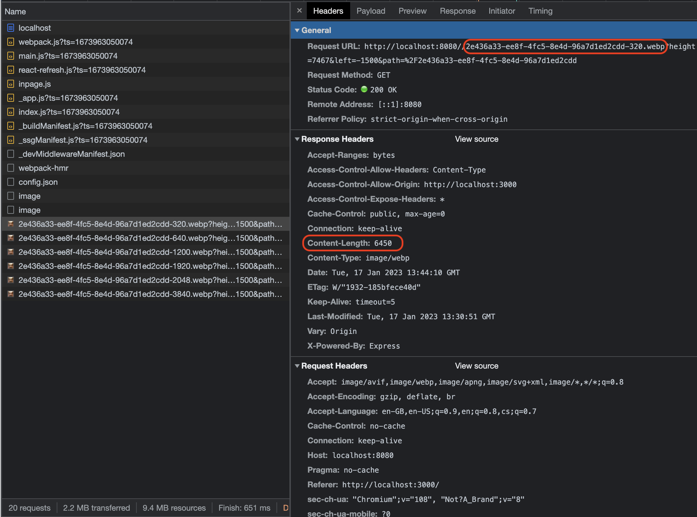

# Image service

Simple tool to upload and edit pictures. The front-end is using in **NextJs** and Backend **NodeJs.**

**NodeJs** is used to be able to easily test and iterate on localhost. Production level solution will be released fully on **NextJs with S3** as storage, later on**.**


[https://github.com/4rokis/image-service-example](https://github.com/4rokis/image-service-example)

## Getting Started
1. `npm i`
2. `npm run build`
3. `npm run start`
4. Go to http://localhost:3000


## Upload new Image

### Client


Once a user selects an image, he can modify the image(crop, zoom, rotate) via [react-easy-crop](https://www.npmjs.com/package/react-easy-crop) library.

Once finished the original file and transformations data are passed to the ImageService.

### Backend


Image service accepts an image and saves it to storage (Local files, S3, Firebase, …) and takes the image, and applies used modifications (crop, zoom, rotate). The modified image is then saved in multiple sizes/scales (160, 320, 640, 750, 828, …) for a user to fetch the desired size based on their screen size.

### Fetch uploaded Image


ImageService returns the image path on success. Client then can use [NextImage](https://nextjs.org/docs/api-reference/next/image) with a custom loader

```jsx
import NextImage from 'next/image'

const parseFileName = (path) => {
  const pathParts = path.split('/')
  const filename = pathParts[pathParts.length - 1]
  return filename.split('.')
}

const myLoader = ({ src, width }) => {
  if (!src) {
    return ''
  }
  const [path, params, name, end] = parseFileName(src)
  return `${IMAGE_BASE_URL}/${name}-${width}.${end}`
}

export const Image = ({
  className,
  src,
  sizes,
}) => {
  return (
    <NextImage
      {...rest}
      loader={myLoader}
      src={src}
      sizes={sizes}
    />
  )
}
```

or native image with srcSet

```jsx
import React, { HTMLAttributes } from 'react'

import { getSrcSet } from './utils'

export const Image = ({
  src,
  sizes,
}) => {
  return (
    
  )
}
Image.displayName = 'Image'
```

to fetch the image.

The page then can use [sizes](https://developer.mozilla.org/en-US/docs/Web/API/HTMLImageElement/sizes) prop to define what is the actual image size.

```jsx
<Image src={image} sizes={`600px`} />
<Image src={image} sizes={`50vw`} />
<Image src={image} sizes={`12rem`} />
```

In the network tab you can see that the correct image sizes were fetched ([Github example](https://github.com/4rokis/image-service-example))




## Edit Uploaded Image


Editing an already uploaded image works similarly, but the image is not sent from the client as it is already in storage. The Image Crop component fetches the original image and based on file query parameters shows the correct state. The ImageService then based on the image name and new transformations updates images.

## Kudos

Architecture, Code, and Configs come from [Style Space](https://wwwh.stylespace.com/?utm_medium=arokis-blog)

> Connect with expert stylists, over 1-on-1 video styling sessions for clothing, hair, and makeup/skincare styling. Elevate your style, simplify getting ready and save time and money.
>

## Links

- [https://www.npmjs.com/package/react-easy-crop](https://www.npmjs.com/package/react-easy-crop)
- [https://github.com/4rokis/image-service-example](https://github.com/4rokis/image-service-example)
- [https://developer.mozilla.org/en-US/docs/Web/API/HTMLImageElement/sizes](https://developer.mozilla.org/en-US/docs/Web/API/HTMLImageElement/sizes)
- [https://nextjs.org/docs/api-reference/next/image](https://nextjs.org/docs/api-reference/next/image#loader)
- [https://sharp.pixelplumbing.com](https://sharp.pixelplumbing.com/)